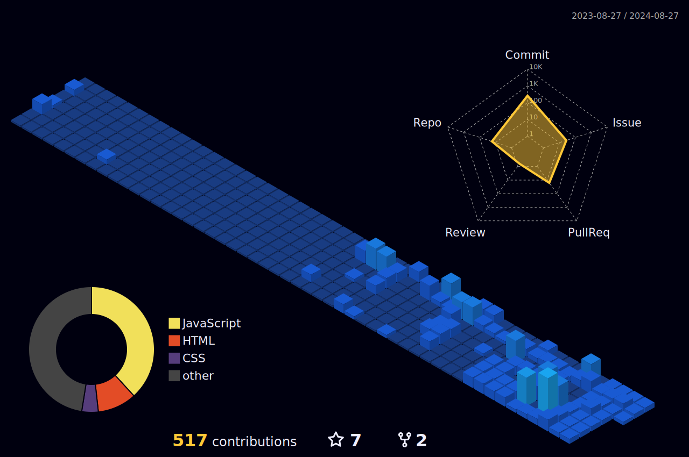

    

<h1 align="center">
    Hi , I'm Pawan Lekurwale
</h1>

 👋 Hi, I’m @plpatil1
- 👀 I’m interested in Web Developement 
- 🌱 I’m a Full Stack Developer
- 
- 

Innovative Electrical Engineer turned aspiring Full-Stack Web Developer with robust Java expertise and a passion for creating scalable applications. Proficient in a diverse tech stack including JavaScript, React.js, Node.js, Next.js, and more, I excel in building responsive, user-centric web interfaces. With hands-on experience in version control, I lead and collaborate on impactful projects. Known for quick learning, creativity, and problem-solving, I’m eager to contribute to transformative IT projects, driving technological innovation.

    

  

<h1 align="center">🛠 Skills & Tools</h1>

 
&nbsp;&nbsp;
&nbsp;&nbsp;

<!--       -->
  
  
  
  
  
  
<!--    -->
<!--    -->
  
  
  
  
  
<!--    -->
  
 
  

### Trophies

  

## GitHub Profile

       
### Profile Summary

  

### 3D Contribution Graph

  

---

